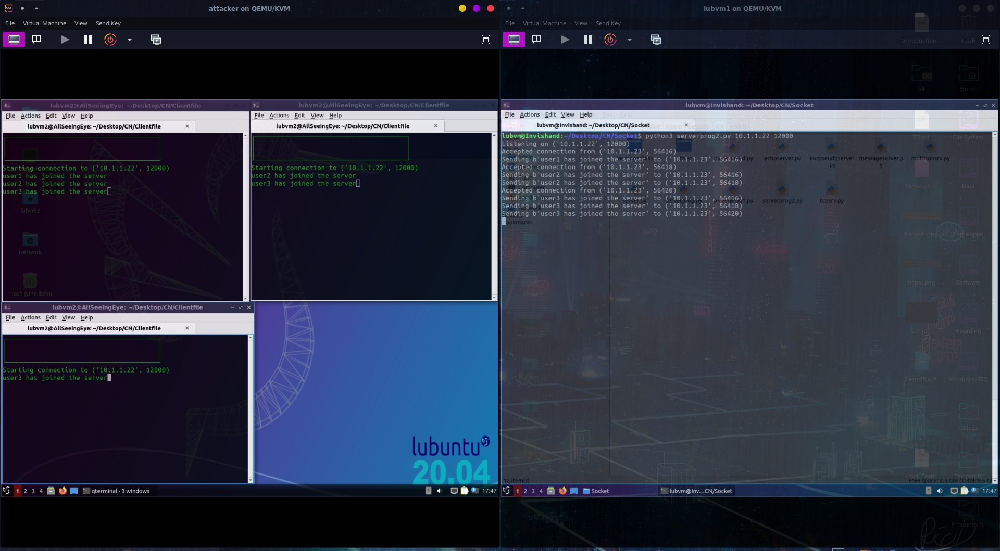
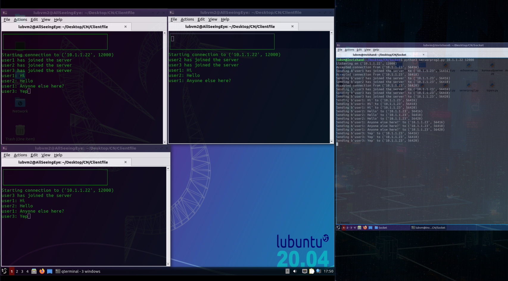
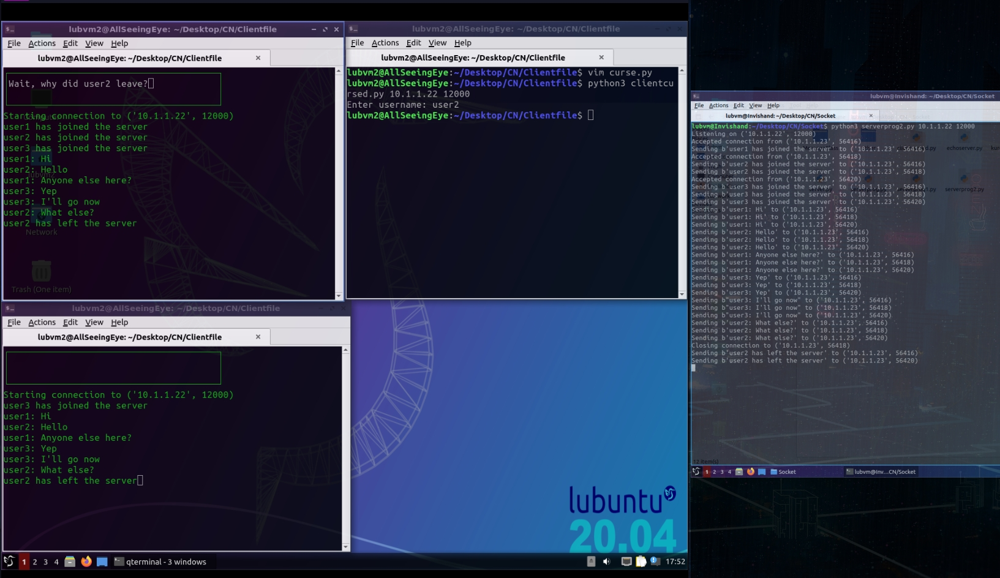
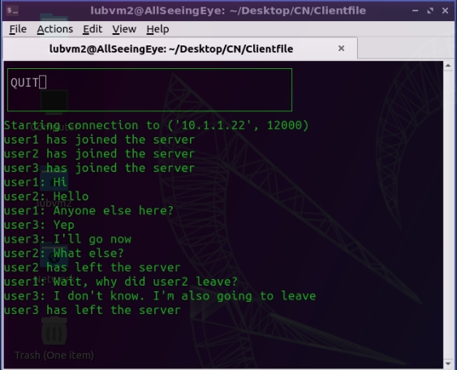

# Basic-Chatroom-Application-Python
A chatroom application that I made in my 4th semester, in the course "Computer Networks".

***

## Abstract

In a chatroom, users can instantly communicate with each other and send text messages that are seen by every user, in real time. The implementation uses the client-server approach, where one server always remains on, and clients can connect to the server and send messages that can be seen by every other client connected to the server. Each client can have his/her own name. 

- The job of the server is to get messages from the client and to broadcast it to every other client. 
- The job of the client is to send messages to, and receive messages from the server. 

Some details: 
	- TCP is used as the transport layer protocol. 
	- This application is not truly asyncronous: It polls each socket on every cycle and uses selectors instead of threads. 
	- The clients can leave the server whenever they want by typing "QUIT" as the message. 
	- The GUI is implemented in a terminal-based GUI library called curses. 
	- Messages are not persistent (they are only printed to the screen, not stored anywhere). 
	- * The user receives messages in real time as long as the user himself is not typing anything in the message field. Even then, as soon as the user finishes typing and submits his/her message, he/she will receive all the messages that had arrived in the duration of the user typing the message. * * (This is due to curses.getkey() blocking the execution flow. For more details, please check line 10's third point in the algorithm given ahead).

##Algorithms: 
### 1) Server: 
Global variables: A common buffer (commonbuff)to store all incoming messages from clients: Implemented as a list. A dictionary mapping client addresses to usernames (users). 

**Part A**
	1. Start server. 
	2. Create a socket as the listening/welcoming socket for this server program. 
	3. Bind the socket to the given address and port, and set it's state to 'listening', and setblocking state to False to prevent the socket's accept/recv from blocking the execution of the program.
	4. Register the socket to the OS selectors.

**Part B**: Event loop
	5. While True, assign burst as the length of the common-buffer.
	6. Use selectors to get the states of all the connected sockets (whether they're ready to read/write, etc).
	7. For every socket, service the socket.
	    	- Socket being serviced is the listening socket:
	We have a new client trying to connect: Accept the connection and get the new socket to which the client will be connected. For each new socket, there will be a dedicated address, an input buffer and and output buffer associated with it. Then, let this socket be registered to the selectors. After this, the very first data received from the socket will be the username for the client. So, map the address of this client with it's username, and send messages to all other clients that a new user has joined the server.
	    	- Socket being serviced is a client's socket:
	There are cases here:
	1. The socket is ready to read: Receive data from the socket. If the data is not null, append this data to the common-buffer. If the data is null, this means that the client has left the connection, so close the socket and unregister it, and also send a message to all other clients stating that this user has left the server.
	2. The socket is ready to write: If there are any messages in the common-buffer, then send each of those messages to this client, in-order.
	8. Remove the first 'burst' number of messages from the common-buffer.
	
**Part C**: Stopping the server
	9. The user must raise KeyboardInterrupt to stop the server. 
	10. When this is detected, close all the sockets registered in the selector and finish the program.

###2) Client:

Global variables:
 
    	- List called "in-buffer" (inbuff) that stores all incoming messages from the server, and prints it on the user's screen when the screen is ready to print.
    	- List called "user-message-buffer" (messages) that stores user's typed messages and sends them into the socket's input buffer whenever the socket is ready.
    	- Boolean running that decides the control of the program (running, or to terminate).

**Part A**: Establishing connection
	1. Start client file.
	2. Ask the user for a username
	3. Create a new socket for connecting with the server.
	4. Connect with the server.
	    	- If the server is unavailable, tell the user to recheck the IP address and port number, and make sure that the server is running.
	    	- If the server is available, connection will be established successfully.
	5. Register this socket to the DefaultSelector, so that we can then poll on this socket every cycle of the event loop.
	6. Send the username to the server, and then set the socket type to non-blocking (so that execution for this socket does not block the control flow of the program).

**Part B**: More initializations
	7. Initialize the curses standard screen as well as a curses window for the user to be able to provide input.

**Part C**: Event loop
	8. Loop runs as long as the global variable running is set to True.
	9. Inside the loop, first we use selectors to find the state of the socket.
	10. Then, depending on the state of the socket (if the socket is ready to read, or if the socket is ready to write), we take actions.
	    	- Socket is ready to read:
	Receive the data available in the socket's in-buffer. If the data is not NULL, append it to the program's in-buffer list.
	    	- Socket is ready to write:
	If there is no data in the socket's out-buffer, and the user-message-buffer does contain messages, then pop the first message in the list and place it in the socket's out-buffer.
	If there is data in the socket's out-buffer, then send that data through the socket.
	    	- If there are no messages from the user in the user-message-buffer:
	Allow the user to type messages. If the user does press any keys, then the program's control gets shifted to win.getkey() which blocks the execution of other instructions, hence waiting for the user to finish typing and to send the message in the message box. When the user finally hits the send button (Ctrl-G by default), the message gets stored into the user-message-buffer. If this message is "QUIT", the program sets the value of running to False.
	11. If the screen is filled up with messages, clear the screen and move the output pointer to the top of the screen again.
	12. If there are messages in the in-buffer, print them to the screen.

Part D: Exiting the program
	13. Before exiting the program, the socket's input buffer must be emptied. This is done by calling recv on the socket again.
	14. Un-register the socket from the OS selector, and then close the socket.

##Screenshots:

